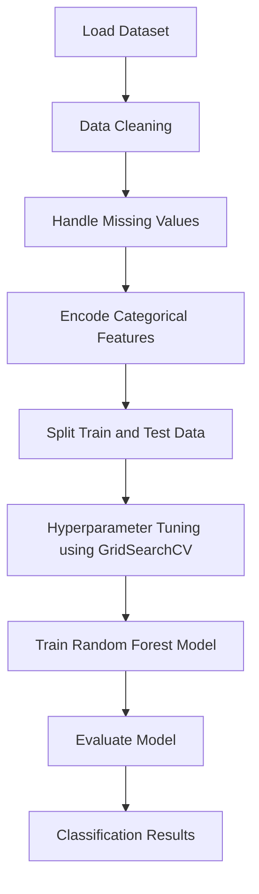

<div align="center">

# 🚦 Network Traffic Classification Using Random Forest


A beginner-friendly machine learning project that classifies network traffic as **Normal** or **Attack** using the **Random Forest algorithm**.

</div>

---

# 📑 Table of Contents

* Overview
* Project Objective
* Tools Used
* Libraries USED
* How It Works — Step-by-step
* Workflow
* Key Concepts
* What I Learned
* Through this project I also gained insight into
* Project Structure
* How to Run the Project
* Future Improvements
* Author
* License

---

# 📘 Overview

Network security is one of the most critical challenges in modern computing systems. As networks grow larger and more complex, detecting malicious activities manually becomes extremely difficult.

Machine learning provides a powerful solution by automatically analyzing patterns in network traffic and identifying suspicious behavior.

This project demonstrates how a **Random Forest classifier** can be used to analyze network traffic and classify each connection as either:

• **Normal traffic**
• **Attack traffic**

By training the model on historical network data, it learns patterns that distinguish safe connections from malicious ones.

The project also demonstrates a **complete machine learning workflow**, including preprocessing, model training, hyperparameter tuning, and evaluation.

---

# 🎯 Project Objective

The main goals of this project are:

• Build a **machine learning classifier for intrusion detection**
• Understand how **Random Forest works for classification tasks**
• Learn the **complete machine learning pipeline**
• Practice **data preprocessing and feature encoding**
• Evaluate model performance using **standard ML metrics**

---

# 🛠 Tools Used

The following tools were used to build this project.

### Python

The primary programming language used to implement the machine learning system.

### Jupyter Notebook

Used for experimentation, testing, and interactive model development.

### Git & GitHub

Used for version control and project sharing.

---

# 📚 Libraries USED

This project relies on several powerful Python libraries.

### pandas

Used for data loading, cleaning, and manipulation of tabular datasets.

### scikit-learn

Provides machine learning tools including:

• Random Forest classifier
• Train-test splitting
• Hyperparameter tuning
• Evaluation metrics

### numpy

Used for numerical operations and array manipulation.

### scipy

Supports scientific computations used by machine learning algorithms.

Install the required libraries using:

```
pip install pandas scikit-learn numpy scipy
```

---

# ⚙️ How It Works — Step-by-step

The machine learning system works through the following steps:

1. Load the dataset into a pandas DataFrame.
2. Separate the dataset into **features (inputs)** and **labels (target values)**.
3. Handle missing values using the **most frequent value in each column**.
4. Convert categorical features into numerical form.
5. Convert labels into binary values:

```
0 = Normal Traffic
1 = Attack Traffic
```

6. Split the dataset into **training data (70%)** and **testing data (30%)**.
7. Apply **GridSearchCV** to find the best Random Forest parameters.
8. Train the optimized model using the training dataset.
9. Evaluate model performance using classification metrics.

---

# 🔄 Workflow

Below is the complete machine learning workflow used in this project.



This diagram represents the **full machine learning pipeline** implemented in the project.

---

# 🧠 Key Concepts

## Random Forest

Random Forest is an **ensemble learning algorithm** that combines multiple decision trees to improve prediction accuracy.

Instead of relying on a single tree, Random Forest creates many trees and aggregates their predictions.

Advantages:

• High accuracy
• Reduced overfitting
• Handles complex datasets well

---

## Stratify

Stratification ensures that **training and testing datasets maintain the same class distribution**.

Example:

```
Normal Traffic = 70%
Attack Traffic = 30%
```

Both datasets preserve this ratio to prevent bias.

---

## Hyperparameters

Hyperparameters are configuration values that control how the model learns.

Examples:

```
n_estimators
max_depth
min_samples_split
```

These parameters are optimized using **GridSearchCV**.

---

## Evaluation Metrics

The model performance is evaluated using several metrics.

### Accuracy

Overall proportion of correct predictions.

```
Accuracy = Correct Predictions / Total Predictions
```

### Precision

Measures how many predicted attacks were actually attacks.

### Recall

Measures how many real attacks were detected.

### F1 Score

Balances both precision and recall.

---

# 🎓 What I Learned

Through this project, I gained practical experience in:

• Building a **machine learning classification model**
• Data preprocessing and feature engineering
• Hyperparameter tuning using **GridSearchCV**
• Understanding ensemble learning methods
• Evaluating models using **classification metrics**

This project strengthened my understanding of **machine learning and cybersecurity applications**.

---

# 💡 Through this project I also gained insight into

• How machine learning can support **intrusion detection systems**
• The importance of **data preprocessing** in ML pipelines
• Why ensemble models like **Random Forest perform well**
• How balanced datasets improve model reliability
• Best practices for structuring a **machine learning project**

---

# 📁 Project Structure

```
network-traffic-classification
│
├── KDDDataset.txt
├── model.ipynb
├── model.py
├── README.md
```

Description:

• **KDDDataset.txt** → Network traffic dataset
• **model.ipynb** → Jupyter notebook implementation
• **model.py** → Python script version of the model
• **README.md** → Project documentation

---

# ▶️ How to Run the Project

### Step 1 — Clone the Repository

```
git clone https://github.com/ft-FiasCode/network-traffic-classification.git
```

### Step 2 — Navigate to the Project Directory

```
cd network-traffic-classification
```

### Step 3 — Install Required Libraries

```
pip install pandas scikit-learn numpy scipy
```

### Step 4 — Add the Dataset

Place the dataset file in the project directory:

```
KDDDataset.txt
```

### Step 5 — Run the Project

Run using Jupyter Notebook:

```
jupyter notebook
```

or run the Python script:

```
python model.py
```

The model will train and display evaluation results.

---

# 🚀 Future Improvements

Possible improvements for this project include:

• Adding **data visualization using Matplotlib and Seaborn**
• Testing additional algorithms such as **SVM and Logistic Regression**
• Building a **real-time intrusion detection system**
• Deploying the model using **Flask or FastAPI**
• Performing **feature importance analysis**

---

# 👨‍💻 Author


**ft-FiasCode**

GitHub: [https://github.com/ft-FiasCode](https://github.com/ft-FiasCode)

---

# 📜 License

MIT License: 

This project is open-source and free to use, modify, and distribute.


---

<div align="center">

⭐ If you found this project useful, consider **starring the repository**.

</div>
